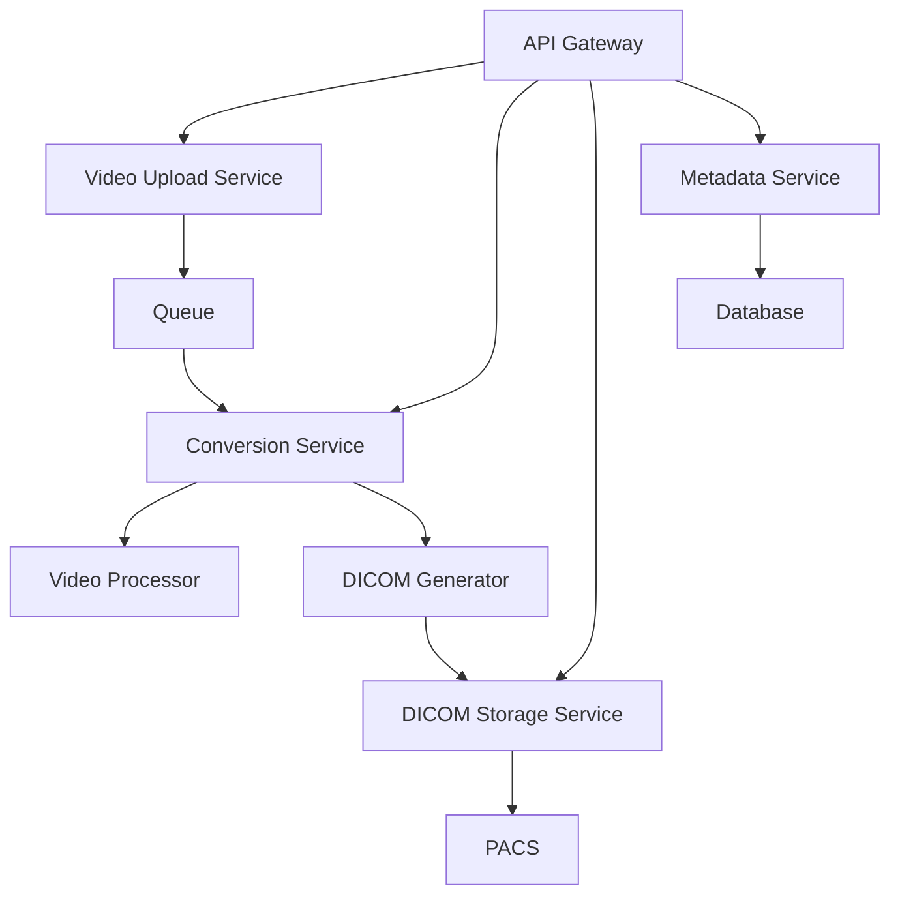

# Video to DICOM Implementation Guide

## Executive Summary

This implementation guide provides a comprehensive framework for building production-ready video-to-DICOM conversion systems. Based on deep technical analysis and clinical requirements, this guide offers practical strategies for implementing robust, scalable, and clinically-integrated video conversion solutions.

## 1. Technical Foundation

### 1.1 DICOM Video Standards Overview

#### Supported Transfer Syntaxes
```
1.2.840.10008.1.2.4.100 - MPEG2 Main Profile @ Main Level
1.2.840.10008.1.2.4.101 - MPEG2 Main Profile @ High Level
1.2.840.10008.1.2.4.102.1 - MPEG-4 AVC/H.264 High Profile / Level 4.1
1.2.840.10008.1.2.4.103.1 - MPEG-4 AVC/H.264 BD-compatible High Profile
1.2.840.10008.1.2.4.104.1 - MPEG-4 AVC/H.264 High Profile For 2D Video
1.2.840.10008.1.2.4.105.1 - MPEG-4 AVC/H.264 High Profile For 3D Video
1.2.840.10008.1.2.4.106.1 - MPEG-4 AVC/H.264 Stereo High Profile
```

#### Key DICOM Modules for Video
- **Patient Module** (C.7.1.1) - Patient demographics
- **Study Module** (C.7.2.1) - Study information
- **Series Module** (C.7.3.1) - Series metadata
- **Cine Module** (C.7.6.5) - Frame rate, duration
- **Multi-frame Module** (C.7.6.6) - Frame organization
- **SOP Common Module** (C.12.1) - Instance identifiers

### 1.2 Video Storage Approaches

#### Approach 1: Compressed Video (Recommended)
```python
# Advantages:
- Efficient storage (90% less space)
- Native video codec support
- Streaming capabilities
- Faster network transfer

# Implementation:
def store_compressed_video(video_path, dicom_dataset):
    # Store entire video as single pixel data element
    with open(video_path, 'rb') as video_file:
        dicom_dataset.PixelData = video_file.read()
    dicom_dataset.TransferSyntaxUID = '1.2.840.10008.1.2.4.102.1'  # H.264
```

#### Approach 2: Frame-by-Frame Storage
```python
# Advantages:
- Frame-level access
- Partial retrieval support
- Legacy PACS compatibility

# Implementation:
def store_frames(video_frames, dicom_dataset):
    # Convert each frame to DICOM multi-frame
    pixel_array = np.array(video_frames)
    dicom_dataset.PixelData = pixel_array.tobytes()
    dicom_dataset.NumberOfFrames = len(video_frames)
```

## 2. Library Analysis and Recommendations

### 2.1 Library Comparison Matrix

| Library | Language | Performance | Memory | License | Recommendation |
|---------|----------|-------------|---------|----------|----------------|
| **pydicom** | Python | Medium | Good | MIT | Best for Python projects |
| **fo-dicom** | C# | High | Excellent | MS-PL | Best for .NET ecosystem |
| **DCMTK** | C++ | Highest | Excellent | BSD | Best for performance-critical |
| **GDCM** | C++ | High | Good | BSD | Best for cross-platform |

### 2.2 Recommended Stack by Use Case

#### High-Volume Processing (>1000 videos/day)
```yaml
Primary: DCMTK (C++)
Video Processing: FFmpeg
Queue: RabbitMQ/Kafka
Storage: Object storage (S3/MinIO)
Caching: Redis
```

#### Rapid Development
```yaml
Primary: pydicom (Python)
Video Processing: OpenCV/moviepy
Queue: Celery
Storage: Local filesystem/NAS
Framework: FastAPI
```

#### Enterprise .NET Environment
```yaml
Primary: fo-dicom (C#)
Video Processing: MediaFoundation
Queue: Azure Service Bus
Storage: Azure Blob Storage
Framework: ASP.NET Core
```

## 3. Architecture Design Patterns

### 3.1 Microservice Architecture (Recommended)



#### Key Components:

**1. Video Upload Service**
```python
class VideoUploadService:
    async def upload(self, video_stream, metadata):
        # Validate video format
        if not self.validate_format(video_stream):
            raise InvalidFormatError()
        
        # Store temporarily
        temp_id = await self.temp_storage.store(video_stream)
        
        # Queue for processing
        await self.queue.publish({
            'temp_id': temp_id,
            'metadata': metadata,
            'priority': self.calculate_priority(metadata)
        })
```

**2. Conversion Service**
```python
class ConversionService:
    def __init__(self):
        self.pool = ProcessPoolExecutor(max_workers=cpu_count())
        
    async def convert(self, job):
        # Retrieve video
        video_data = await self.temp_storage.get(job['temp_id'])
        
        # Process in parallel
        future = self.pool.submit(self._convert_video, video_data, job['metadata'])
        
        # Store result
        dicom_instance = await future
        await self.dicom_storage.store(dicom_instance)
```

### 3.2 Performance Optimization Strategies

#### GPU Acceleration
```python
import cv2
import numpy as np

class GPUVideoProcessor:
    def __init__(self):
        # Enable GPU acceleration
        cv2.ocl.setUseOpenCL(True)
        
    def process_video(self, input_path, output_codec='h264_nvenc'):
        # Use hardware acceleration
        cap = cv2.VideoCapture(input_path, cv2.CAP_FFMPEG)
        cap.set(cv2.CAP_PROP_HW_ACCELERATION, cv2.VIDEO_ACCELERATION_ANY)
        
        # Process with GPU
        fourcc = cv2.VideoWriter_fourcc(*'H264')
        # ... processing logic
```

#### Memory-Efficient Processing
```python
class ChunkedVideoProcessor:
    def __init__(self, chunk_size=100):  # Process 100 frames at a time
        self.chunk_size = chunk_size
        
    def process_large_video(self, video_path):
        with VideoFileClip(video_path) as video:
            total_frames = int(video.fps * video.duration)
            
            for i in range(0, total_frames, self.chunk_size):
                # Process chunk
                chunk = video.subclip(i/video.fps, (i+self.chunk_size)/video.fps)
                yield self.process_chunk(chunk)
```

## 4. Clinical Integration Framework

### 4.1 PACS Integration Strategy

#### Compatibility Matrix
| PACS System | Video Support | Recommended Approach |
|-------------|---------------|---------------------|
| Orthanc | Full | Direct DICOM store |
| DCM4CHEE | Full | Direct DICOM store |
| Philips IntelliSpace | Partial | Compressed + thumbnails |
| GE Centricity | Limited | Frame extraction |
| Agfa IMPAX | Partial | Vendor API |

#### Integration Pattern
```python
class PACSIntegration:
    def __init__(self, pacs_config):
        self.ae_title = pacs_config['ae_title']
        self.host = pacs_config['host']
        self.port = pacs_config['port']
        
    async def store_video_dicom(self, dicom_instance):
        # Test PACS capabilities
        capabilities = await self.test_pacs_capabilities()
        
        if capabilities.supports_video:
            # Direct store
            await self.c_store(dicom_instance)
        else:
            # Fallback strategy
            await self.store_with_fallback(dicom_instance)
    
    async def store_with_fallback(self, dicom_instance):
        # Extract key frames
        key_frames = self.extract_key_frames(dicom_instance)
        
        # Store as multi-frame
        mf_instance = self.create_multiframe(key_frames)
        await self.c_store(mf_instance)
        
        # Store video separately if supported
        if self.pacs_config.get('video_archive'):
            await self.store_to_video_archive(dicom_instance)
```

### 4.2 Workflow Integration

#### HL7/FHIR Messaging
```python
class ClinicalWorkflowIntegration:
    def __init__(self, hl7_client, fhir_client):
        self.hl7 = hl7_client
        self.fhir = fhir_client
        
    async def process_video_order(self, order_message):
        # Parse HL7 ORM message
        order = self.hl7.parse_orm(order_message)
        
        # Create FHIR ImagingStudy
        imaging_study = {
            "resourceType": "ImagingStudy",
            "status": "available",
            "modality": [{
                "system": "http://dicom.nema.org/resources/ontology/DCM",
                "code": "XC"  # Video photographic imaging
            }],
            "subject": {"reference": f"Patient/{order.patient_id}"},
            "started": order.study_date,
            "numberOfSeries": 1,
            "numberOfInstances": 1
        }
        
        # Update FHIR server
        await self.fhir.create(imaging_study)
```

## 5. Quality Assurance Framework

### 5.1 Automated Testing Pipeline

```python
class VideoQualityValidator:
    def __init__(self):
        self.quality_thresholds = {
            'psnr': 30.0,  # Peak Signal-to-Noise Ratio
            'ssim': 0.85,  # Structural Similarity Index
            'bitrate_variance': 0.2,  # 20% variance allowed
            'frame_drop_rate': 0.001  # 0.1% max frame drops
        }
    
    def validate_conversion(self, original_video, dicom_video):
        results = {
            'psnr': self.calculate_psnr(original_video, dicom_video),
            'ssim': self.calculate_ssim(original_video, dicom_video),
            'bitrate': self.analyze_bitrate(dicom_video),
            'frames': self.verify_frames(original_video, dicom_video)
        }
        
        # Check against thresholds
        for metric, value in results.items():
            if value < self.quality_thresholds.get(metric, 0):
                raise QualityValidationError(f"{metric} below threshold: {value}")
        
        return results
```

### 5.2 DICOM Conformance Testing

```python
class DICOMConformanceValidator:
    def __init__(self):
        self.required_tags = [
            (0x0008, 0x0016),  # SOP Class UID
            (0x0008, 0x0018),  # SOP Instance UID
            (0x0010, 0x0010),  # Patient Name
            (0x0010, 0x0020),  # Patient ID
            (0x0020, 0x000D),  # Study Instance UID
            (0x0020, 0x000E),  # Series Instance UID
            (0x0028, 0x0008),  # Number of Frames
            (0x0018, 0x0040),  # Cine Rate
        ]
    
    def validate_dicom(self, dicom_file):
        ds = pydicom.dcmread(dicom_file)
        
        # Check required tags
        missing_tags = []
        for tag in self.required_tags:
            if tag not in ds:
                missing_tags.append(tag)
        
        if missing_tags:
            raise ConformanceError(f"Missing required tags: {missing_tags}")
        
        # Validate video-specific attributes
        self.validate_video_attributes(ds)
        
        return True
```

## 6. Production Deployment Guide

### 6.1 Infrastructure Requirements

```yaml
# Minimum Production Requirements
compute:
  cpu: 8 cores (16 recommended)
  memory: 32GB (64GB recommended)
  gpu: Optional (NVIDIA T4 or better for acceleration)

storage:
  temp_storage: 500GB NVMe SSD
  archive_storage: 10TB+ (depends on retention)
  iops: 10,000+ for temp storage

network:
  bandwidth: 1Gbps minimum
  latency: <10ms to PACS

software:
  os: Ubuntu 20.04 LTS / RHEL 8
  container: Docker 20.10+ / Kubernetes 1.21+
  monitoring: Prometheus + Grafana
```

### 6.2 Deployment Configuration

```yaml
# docker-compose.yml
version: '3.8'

services:
  video-converter:
    image: video-to-dicom:latest
    deploy:
      replicas: 3
      resources:
        limits:
          cpus: '4'
          memory: 16G
        reservations:
          cpus: '2'
          memory: 8G
    environment:
      - REDIS_URL=redis://redis:6379
      - PACS_AE_TITLE=VIDEO_CONVERTER
      - MAX_PARALLEL_CONVERSIONS=4
    volumes:
      - /mnt/video-temp:/tmp/videos
      - /mnt/dicom-output:/output
    
  redis:
    image: redis:7-alpine
    volumes:
      - redis-data:/data
    
  monitoring:
    image: prom/prometheus
    volumes:
      - ./prometheus.yml:/etc/prometheus/prometheus.yml
    
volumes:
  redis-data:
  video-temp:
```

### 6.3 Monitoring and Alerting

```python
# Metrics collection
from prometheus_client import Counter, Histogram, Gauge

# Define metrics
conversion_counter = Counter('video_conversions_total', 'Total video conversions')
conversion_duration = Histogram('video_conversion_duration_seconds', 'Conversion duration')
queue_size = Gauge('conversion_queue_size', 'Current queue size')
error_counter = Counter('conversion_errors_total', 'Total conversion errors', ['error_type'])

class MonitoredConverter:
    @conversion_duration.time()
    def convert_video(self, video_path):
        try:
            result = self._perform_conversion(video_path)
            conversion_counter.inc()
            return result
        except Exception as e:
            error_counter.labels(error_type=type(e).__name__).inc()
            raise
```

## 7. Security Implementation

### 7.1 Data Protection

```python
class SecureVideoProcessor:
    def __init__(self, encryption_key):
        self.cipher_suite = Fernet(encryption_key)
    
    def process_video(self, video_data, patient_info):
        # Encrypt at rest
        encrypted_video = self.cipher_suite.encrypt(video_data)
        
        # Audit trail
        self.audit_log.record({
            'action': 'video_processing',
            'patient_id': self.hash_patient_id(patient_info['id']),
            'timestamp': datetime.utcnow(),
            'user': self.current_user
        })
        
        # Process with minimal PII exposure
        dicom_data = self.convert_to_dicom(
            encrypted_video,
            self.anonymize_metadata(patient_info)
        )
        
        return dicom_data
```

### 7.2 Access Control

```python
class RBACVideoAccess:
    def __init__(self):
        self.permissions = {
            'physician': ['view', 'annotate'],
            'technician': ['upload', 'convert'],
            'admin': ['view', 'upload', 'convert', 'delete']
        }
    
    def check_access(self, user, action, resource):
        user_role = self.get_user_role(user)
        allowed_actions = self.permissions.get(user_role, [])
        
        if action not in allowed_actions:
            raise PermissionDeniedError(f"User {user} cannot {action}")
        
        # Additional checks for sensitive data
        if self.is_sensitive(resource):
            self.require_additional_auth(user)
```

## 8. Performance Benchmarks and Optimization

### 8.1 Expected Performance Metrics

| Video Type | Resolution | Duration | Conversion Time | Storage Size |
|------------|------------|----------|-----------------|--------------|
| Endoscopy | 1080p | 5 min | 8-12 sec | 150-200 MB |
| Surgery | 4K | 30 min | 90-120 sec | 2-3 GB |
| Ultrasound | 720p | 2 min | 3-5 sec | 50-80 MB |
| Angiography | 1080p | 10 min | 15-20 sec | 300-400 MB |

### 8.2 Optimization Techniques

```python
class OptimizedVideoConverter:
    def __init__(self):
        # Pre-allocate resources
        self.buffer_pool = BufferPool(size=100 * 1024 * 1024)  # 100MB pool
        self.thread_pool = ThreadPoolExecutor(max_workers=cpu_count())
        
    async def convert_batch(self, video_list):
        # Sort by size for optimal resource usage
        sorted_videos = sorted(video_list, key=lambda v: v.size)
        
        # Process in parallel with resource limits
        semaphore = asyncio.Semaphore(4)  # Max 4 concurrent
        
        async def convert_with_limit(video):
            async with semaphore:
                return await self.convert_single(video)
        
        tasks = [convert_with_limit(v) for v in sorted_videos]
        return await asyncio.gather(*tasks)
```

## 9. Troubleshooting Guide

### 9.1 Common Issues and Solutions

| Issue | Symptoms | Solution |
|-------|----------|----------|
| Memory overflow | OOM errors, system crashes | Implement chunked processing |
| PACS rejection | C-STORE failures | Verify transfer syntax support |
| Frame drops | Missing frames in output | Check codec compatibility |
| Slow conversion | >5x expected time | Enable GPU acceleration |
| Quality loss | Low PSNR/SSIM scores | Adjust compression settings |

### 9.2 Diagnostic Tools

```python
class VideoConversionDiagnostics:
    def diagnose_conversion_failure(self, video_path, error):
        diagnostics = {
            'video_info': self.probe_video(video_path),
            'codec_support': self.check_codec_support(),
            'memory_available': self.get_available_memory(),
            'pacs_connectivity': self.test_pacs_connection(),
            'error_analysis': self.analyze_error(error)
        }
        
        # Generate recommendations
        recommendations = self.generate_recommendations(diagnostics)
        
        return {
            'diagnostics': diagnostics,
            'recommendations': recommendations,
            'suggested_config': self.suggest_configuration(diagnostics)
        }
```

## 10. Future Considerations

### 10.1 Emerging Technologies

- **HEVC Support**: Preparing for DICOM supplement 220
- **Cloud-Native DICOM**: DICOMweb video streaming
- **AI Integration**: Real-time video analysis during conversion
- **Edge Computing**: Local conversion at acquisition devices

### 10.2 Scalability Roadmap

1. **Phase 1**: Single-site deployment (100 videos/day)
2. **Phase 2**: Multi-site federation (1,000 videos/day)
3. **Phase 3**: Cloud hybrid (10,000 videos/day)
4. **Phase 4**: Global distribution (100,000+ videos/day)

## Conclusion

This implementation guide provides a comprehensive framework for building robust video-to-DICOM conversion systems. The key to success lies in:

1. Choosing the right architecture for your scale
2. Implementing proper quality controls
3. Ensuring clinical workflow integration
4. Maintaining security and compliance
5. Planning for scalability from the start

By following these guidelines and adapting them to your specific requirements, you can build a production-ready system that meets both technical and clinical needs.